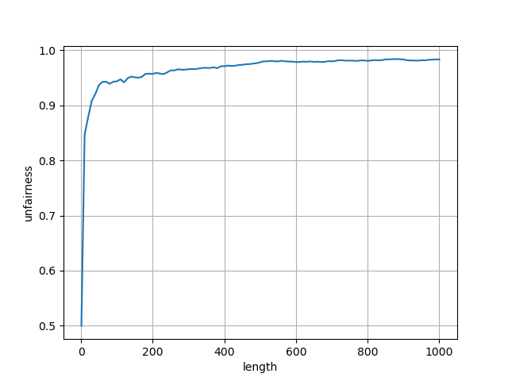
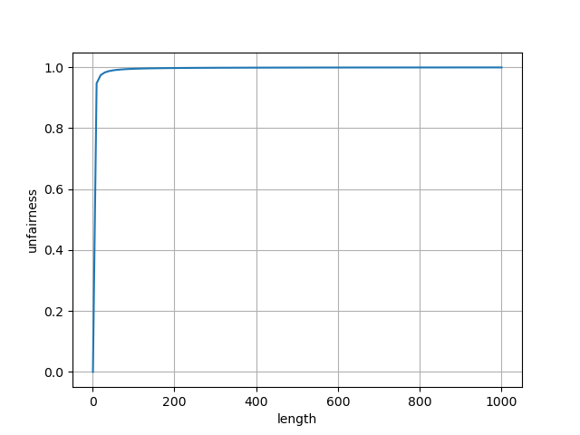

1. Compute the solutions for simulations with 3 jobs and random seeds of 1, 2, and 3.

    ```sh
    $ ./lottery.py --seed=1
    # 2 0* 1 2 2 2* 1 1 1 1 1 1*

    $ ./lottery.py --seed=2
    # 2 0 0 2 0 1 0 2 0 0 0 1 0 0* 1 2 1 1 1 2 1 1* 2*

    $ ./lottery.py --seed=3
    # 1 1 0 1* 0* 2 2 2 2 2 2*
    ```

2. Now run with two specific jobs: each of length 10, but one (job 0) with just 1 ticket and the other (job 1) with 100 (e.g., -l 10:1,10:100). What happens when the number of tickets is so imbalanced? Will job 0 ever run before job 1 completes? How often? In general, what does such a ticket imbalance do to the behavior of lottery scheduling?

    Job 1 will run in priority as intended by the ticket repartition. Job 0 has 10 opportunities to run at least once before job 1 completes, and it has 1% chance to run at any given step. What is the probability of job 0 not running before job 1 completes? It's `(99 / 100)^10`. So job 0 has `100 * (1 - (99 / 100)^10) ≃ 9.56%` chance of running at least once before job 1 completes. Ticket imbalance for jobs of the same length produces unfairness.

    ```sh
    for seed in {0..99}; do
        ./lottery.py --jlist=10:1,10:100 --seed="$seed" -c
    done | ./unfairness.py
    # average unfairness of 100 random experiments: 0.507
    ```

3. When running with two jobs of length 100 and equal ticket allocations of 100 (-l 100:100,100:100), how unfair is the scheduler? Run with some different random seeds to determine the (probabilistic) answer; let unfairness be determined by how much earlier one job finishes than the other.

    ```sh
    for seed in {0..99}; do
        ./lottery.py --jlist=100:100,100:100 --seed="$seed" -c
    done | ./unfairness.py
    # average unfairness of 100 random experiments: 0.9434999999999999
    ```

4. How does your answer to the previous question change as the quantum size (-q) gets larger?

    ```sh
    for quantum in {1..10}; do
        echo -n "q$quantum U="
        for seed in {0..99}; do
            ./lottery.py --quantum="$quantum" --jlist=100:100,100:100 \
                         --seed="$seed" -c
        done | ./unfairness.py
    done
    # q1  U=0.9434999999999999
    # q2  U=0.926
    # q3  U=0.9047058823529412
    # q4  U=0.8976000000000001
    # q5  U=0.87875
    # q6  U=0.8652941176470583
    # q7  U=0.8549999999999999
    # q8  U=0.8499999999999995
    # q9  U=0.8441666666666668
    # q10 U=0.8319999999999997
    ```

    Unfairness increases as quantum size increases with jobs length staying the same.

5. Can you make a version of the graph that is found in the chapter? What else would be worth exploring? How would the graph look with a stride scheduler?

    ```sh
    # lottery plot
    experiments() {
        for seed in {0..29}; do
            ./lottery.py --jlist="$1:100,$1:100" --seed="$seed" -c
        done | ./unfairness.py
    }
    export -f experiments # make function visible to `parallel`

    parallel 'echo "{} $(experiments {})"' ::: 1 {10..1000..10} \
        | ./plot.py > q5lottery.png
    ```

    

    Note: figure 8.2 in the book uses a logarithmic scale for its length axis and mine uses a linear scale.

    ```sh
    # stride plot
    parallel 'echo "{} $(./stride.py {}:100 {}:100 | ./unfairness.py)"' \
        ::: 1 {10..1000..10} \
        | ./plot.py > q5stride.png
    ```

    
