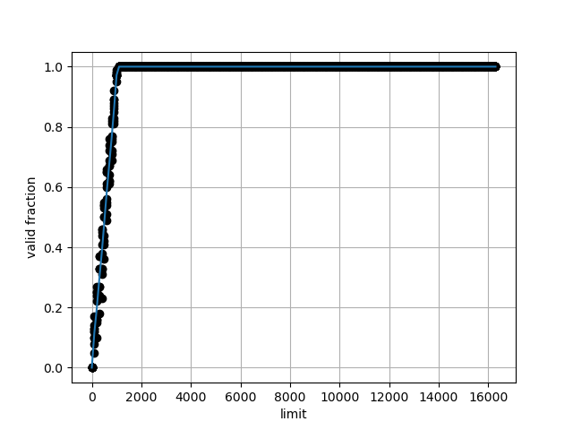

1. Run with seeds 1, 2, and 3, and compute whether each virtual address generated by the process is in or out of bounds. If in bounds, compute the translation.

    ```
    ARG seed 0
    ARG address space size 1k
    ARG phys mem size 16k

    Base-and-Bounds register information:
      Base   : 0x00003082 (decimal 12418)
      Limit  : 472

    Virtual Address Trace
      VA  0: 0x000001ae (decimal:  430) --> 0x00003230 = 12848
      VA  1: 0x00000109 (decimal:  265) --> 0x0000318b = 12683
      VA  2: 0x0000020b (decimal:  523) --> segfault
      VA  3: 0x0000019e (decimal:  414) --> 0x00003220 = 12832
      VA  4: 0x00000322 (decimal:  802) --> segfault
    ```

    ```
    ARG seed 1
    ARG address space size 1k
    ARG phys mem size 16k

    Base-and-Bounds register information:
      Base   : 0x0000363c (decimal 13884)
      Limit  : 290

    Virtual Address Trace
      VA  0: 0x0000030e (decimal:  782) --> segfault
      VA  1: 0x00000105 (decimal:  261) --> 0x00003741 = 14145
      VA  2: 0x000001fb (decimal:  507) --> segfault
      VA  3: 0x000001cc (decimal:  460) --> segfault
      VA  4: 0x0000029b (decimal:  667) --> segfault
    ```

    ```
    ARG seed 2
    ARG address space size 1k
    ARG phys mem size 16k

    Base-and-Bounds register information:

      Base   : 0x00003ca9 (decimal 15529)
      Limit  : 500

    Virtual Address Trace
      VA  0: 0x00000039 (decimal:   57) --> 0x00003ce2 = 15586
      VA  1: 0x00000056 (decimal:   86) --> 0x00003cff = 15615
      VA  2: 0x00000357 (decimal:  855) --> segfault
      VA  3: 0x000002f1 (decimal:  753) --> segfault
      VA  4: 0x000002ad (decimal:  685) --> segfault
    ```

2. Run with these flags: -s 0 -n 10. What value do you have set -l (the bounds register) to in order to ensure that all the generated virtual addresses are within bounds?

    `./relocation.py -s 0 -n 10 -l 930 -c`

3. Run with these flags: -s 1 -n 10 -l 100. What is the maximum value that base can be set to, such that the address space still fits into physical memory in its entirety?

    ```
    ARG phys mem size 16k: 16 KiB = 16384 B
    Limit: 100 B
    maximum base value = 16384 - 100 = 16284
    ```

    `./relocation.py -s 1 -n 10 -l 100 -b 16284 -c`

4. Run some of the same problems above, but with larger address spaces (-a) and physical memories (-p).

5. What fraction of randomly-generated virtual addresses are valid, as a function of the value of the bounds register? Make a graph from running with different random seeds, with limit values ranging from 0 up to the maximum size of the address space.

    ```sh
    experiments() {
        for seed in {0..9}; do
            ./relocation.py --addresses=100 --seed="$seed" --l="$1" -c
        done
    }
    export -f experiments # make function visible to `parallel`

    seq 0 100 16383 \
        | parallel 'experiments {}' \
        | ./plot.py > q5plot.png
    ```

    
