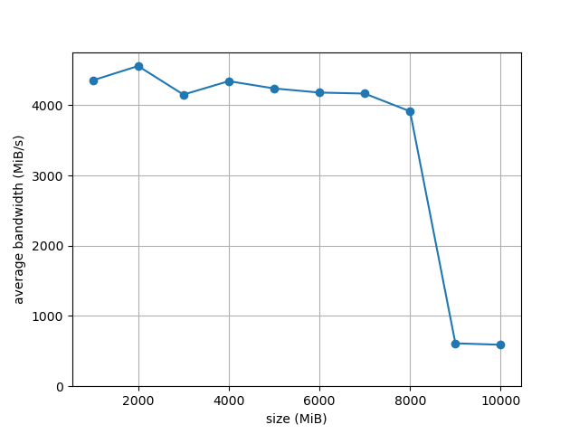

1. First, open two separate terminal connections to the same machine, so that you can easily run something in one window and the other. Now, in one window, run `vmstat 1`, which shows statistics about machine usage every second. Read the man page, `manual.md`, and any other information you need so that you can understand its output. Leave this window running `vmstat` for the rest of the exercises below. Now, we will run the program `mem.c` but with very little memory usage. This can be accomplished by typing `./mem 1` (which uses only 1 MB of memory). How do the CPU usage statistics change when running `mem`? Do the numbers in the `user time` column make sense? How does this change when running more than one instance of `mem` at once?

    The columns in the CPU section are percentages of total CPU time. The user time (`us` column, time spent running non-kernel code) increases (\~+25%), while the idle time (`id` column) decreases (\~-25%). It makes sense since the process running `mem` is running an infinite loop as fast as it can, and thus uses the CPU core it is currently running on as much as it can (on a machine with 4 cores it represents \~25% of total CPU time). Running multiple instances of `mem` will increase total CPU usage by \~25% for each instance (up to \~100%).

2. Let’s now start looking at some of the memory statistics while running `mem`. We’ll focus on two columns: `swpd` (the amount of swap memory used) and `free` (the amount of idle memory). Run `./mem 1024` (which allocates 1024 MB) and watch how these values change. Then kill the running program (by typing control-c) and watch again how the values change. What do you notice about the values? In particular, how does the free column change when the program exits? Does the amount of free memory increase by the expected amount when mem exits?

    ```
    $ vmstat 1
      swpd   free
    3421796 2403832
    3421796 2405228
    3421796 2404716
    3421796 2402116
    # started mem 1024
    3421796 1932540
    3421796 1353732
    3421796 1354740
    3421796 1354992
    3421796 1355360
    3421796 1356516
    3421796 1356516
    3421796 1357412
    # stopped mem 1024
    3421796 1383732
    3421796 2428412
    3421796 2428404
    3421796 2428028
    ```

    `swpd` stays the same, no memory was swapped while `vmstat` and `mem` were running. `mem 1024` allocates 1024 MiB of memory, so vmstat reports that `free` decreased by approximately `1024*1024 KiB`. When `mem` exits, \~1024 MiB are freed as expected (there are other processes running at the same time so it's not surprising that the amount freed is different).

3. We’ll next look at the `swap` columns (`si` and `so`), which indicate how much swapping is taking place to and from the disk. Of course, to activate these, you’ll need to run `mem` with large amounts of memory. First, examine how much free memory is on your Linux system (for example, by typing `cat /proc/meminfo`; type `man proc` for details on the `/proc` file system and the types of information you can find there). One of the first entries in `/proc/meminfo` is the total amount of memory in your system. Let’s assume it’s something like 8 GB of memory; if so, start by running `mem 4000` (about 4 GB) and watching the swap in/out columns. Do they ever give non-zero values? Then, try with 5000, 6000, etc. What happens to these values as the program enters the second loop (and beyond), as compared to the first loop? How much data (total) are swapped in and out during the second, third, and subsequent loops? (do the numbers make sense?)

    ```
    $ vmstat 1
    ...
    # mem 4000
     r  b    swpd    free   buff  cache   si   so    bi    bo     in    cs us sy id wa st
     2  0 4548512 6544164  24216 910044    0    0     0     0   1861  4429 17  8 75  0  0
     1  0 4548512 5062532  24216 910044    0    0     0     0   1932  4637 19 12 69  0  0
     2  0 4548512 3584300  24216 910040    0    0     0     0   1997  5017 15 15 70  0  0
     1  0 4548512 3515000  24216 910044    0    0     0   696   2068  5354 30  5 65  0  0
     1  0 4548512 3513848  24240 910036    0    0     0   128   2230  5183 34  4 62  0  0
     1  0 4548512 3513992  24240 910036    0    0     0     0   1908  4350 32  1 67  0  0
     ...

    $ vmstat 1
    ...
     # mem 8000
     r  b    swpd    free   buff  cache   si   so    bi    bo   in    cs us sy id wa st
     1  0 4235964 7384032  25084 984288    0    0     0     0 2217  5151 11  4 85  0  0
     1  0 4235964 7323408  25092 984288    0    0     0    24 2558  5497 18  3 79  0  0
     2  0 4235964 5859532  25092 984272    0    0     0     0 2604  5721 16 13 71  0  0
     2  0 4235964 4389532  25108 984244    0    0     0    68 2781  6849 18 13 69  0  0
     1  0 4235964 2913544  25108 984260    0    0     0     0 2546  5646 18 11 71  0  0
     1  0 4235964 1454084  25108 984256    0    0     0     0 2643  5616 15 14 71  0  0
     2  0 4204988  252164  25048 926056    0    0     0     0 3031 12223 21 18 62  0  0
     3  0 4340156  261024   3856 716076    0 1948     0  2444 4625 31337 11 44 45  0  0
     1  0 4531644  312812    796 455144    0  204 40848   204 4188  9742 14 54 29  3  0
     2  0 4531644  290572    936 477292    0    0 22044     0 3153  7783 29  3 67  1  0
     5  0 4503996  257896    936 512380    0    0  7776     0 3177  8205 28  3 69  1  0
     2  0 4477372  199432   4984 568852    0    0 33844     0 4736 13111 34  7 56  3  0
     1  0 4477116  197324   6324 570392    0    0  3220     0 2929  6972 28  1 71  0  0
     1  0 4477116  197020   6324 571240    0    0   480     0 2968  7152 27  2 71  0  0
     1  0 4476860  196768   6324 571172    0    0   116     0 2611  5734 28  1 71  0  0
     1  0 4476860  196768   6324 571316    0    0     0     0 2630  5695 28  1 72  0  0
     1  0 4476860  196064   6324 571252    0    0     0     0 3061  6136 30  4 67  0  0
     ...
     ```

    * `mem 4000`: `si` (swap from disk, KiB/s) and `so` (swap to disk, KiB/s) stay at 0, no memory is being swapped.
    * `mem 8000`: memory is being swapped to disk to free some memory for our `mem` program, and then `so` goes back to 0

4. Do the same experiments as above, but now watch the other statistics (such as CPU utilization, and block I/O statistics). How do they change when `mem` is running?

    * `mem 8000`: CPU `wa` (time spent waiting for I/O) increase and I/O activity increase (`bi` and `bo`).

5. Now let’s examine performance. Pick an input for `mem` that comfortably fits in memory (say 4000 if the amount of memory on the system is 8 GB). How long does loop 0 take (and subsequent loops 1, 2, etc.)? Now pick a size comfortably beyond the size of memory (say 12000 again assuming 8 GB of memory). How long do the loops take here? How do the bandwidth numbers compare? How different is performance when constantly swapping versus fitting everything comfortably in memory? Can you make a graph, with the size of memory used by `mem` on the x-axis, and the bandwidth of accessing said memory on the y-axis? Finally, how does the performance of the first loop compare to that of subsequent loops, for both the case where everything fits in memory and where it doesn’t?

    ```
    $ out/mem 4000
    allocating 4194304000 bytes (4000.00 MB)
      number of integers in array: 1048576000
    loop 0 in 2589.94 ms (bandwidth: 1544.44 MB/s)
    loop 1 in 903.95 ms (bandwidth: 4425.04 MB/s)
    loop 2 in 781.68 ms (bandwidth: 5117.20 MB/s)
    loop 3 in 850.06 ms (bandwidth: 4705.55 MB/s)
    loop 4 in 868.64 ms (bandwidth: 4604.88 MB/s)

    $ out/mem 14000
    allocating 14680064000 bytes (14000.00 MB)
      number of integers in array: 3670016000
    loop 0 in 13076.93 ms (bandwidth: 1070.59 MB/s)
    loop 1 in 24012.87 ms (bandwidth: 583.02 MB/s)
    loop 2 in 24060.04 ms (bandwidth: 581.88 MB/s)
    loop 3 in 24677.04 ms (bandwidth: 567.33 MB/s)
    ```

    * Performance is worse when constantly swapping because reading/writing from/to disk is slower than reading/writing from/to memory.
    * For inputs that fit in available memory, iteration 0 takes longer than the following ones. For inputs that don't fit in available memory, iteration 0 is shorter than subsequent ones.
    * `time ./run.sh | ./plot.py > figure.png`
    

6. Swap space isn’t infinite. You can use the tool `swapon` with the `-s` flag to see how much swap space is available. What happens if you try to run `mem` with increasingly large values, beyond what seems to be available in swap? At what point does the memory allocation fail?

    ```
    $ free -m
           total  used  free  shared  buff/cache  available
    Mem:   11859  2968  8114     431         776       8152
    Swap:  12287  4903  7384

    $ out/mem "$((11859 + 12287 + 2))"
    allocating 25321013248 bytes (24148.00 MB)
    memory allocation failed

    $ out/mem "$((8200 + 7500))"
    allocating 25319964672 bytes (24147.00 MB)
      number of integers in array: 6329991168
    Killed
    ```

    * malloc instantly fails if we try to allocate more or equal than `MemTotal + SwapTotal + 2` MiB
    * The OS kills the process after a few seconds if it tries to allocate more than `MemAvailable + SwapFree` MiB

7. Finally, if you’re advanced, you can configure your system to use different swap devices using `swapon` and `swapoff`. Read the man pages for details. If you have access to different hardware, see how the performance of swapping changes when swapping to a classic hard drive, a flash-based SSD, and even a RAID array. How much can swapping performance be improved via newer devices? How close can you get to in-memory performance?
