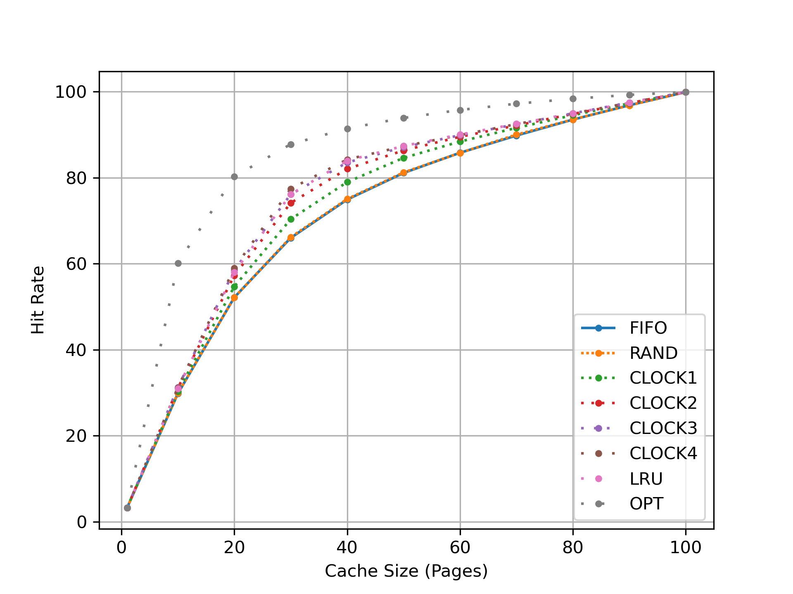

1. Generate random addresses with the following arguments: `-s 0 -n 10`, `-s 1 -n 10`, and `-s 2 -n 10`. Change the policy from FIFO, to LRU, to OPT. Compute whether each access in said address traces are hits or misses.

    ```
    $ ./paging-policy.py -p FIFO -s 0 -n 10
    Access: 8 miss     8
    Access: 7 miss   8,7
    Access: 4 miss 8,7,4
    Access: 2 miss 7,4,2
    Access: 5 miss 4,2,5
    Access: 4 hit  4,2,5
    Access: 7 miss 2,5,7
    Access: 3 miss 5,7,3
    Access: 4 miss 7,3,4
    Access: 5 miss 3,4,5
    hits=1 misses=9 hitrate=10.00

    $ ./paging-policy.py -p LRU -s 0 -n 10
    Access: 8 miss     8
    Access: 7 miss   8,7
    Access: 4 miss 8,7,4
    Access: 2 miss 7,4,2
    Access: 5 miss 4,2,5
    Access: 4 hit  2,5,4
    Access: 7 miss 5,4,7
    Access: 3 miss 4,7,3
    Access: 4 hit  7,3,4
    Access: 5 miss 3,4,5
    hits=2 misses=8 hitrate=20.00

    $ ./paging-policy.py -p OPT -s 0 -n 10
    Access: 8 miss     8
    Access: 7 miss   8,7
    Access: 4 miss 8,7,4
    Access: 2 miss 7,4,2
    Access: 5 miss 7,4,5
    Access: 4 hit  7,4,5
    Access: 7 hit  7,4,5
    Access: 3 miss 4,5,3
    Access: 4 hit  4,5,3
    Access: 5 hit  4,5,3
    hits=4 misses=6 hitrate=40.00
    ...
    ```

2. For a cache of size 5, generate worst-case address reference streams for each of the following policies: FIFO, LRU, and MRU (worst-case reference streams cause the most misses possible. For the worst case reference streams, how much bigger of a cache is needed to improve performance dramatically and approach OPT?

    ```
    $ ./paging-policy.py -C 5 -p FIFO -a 0,1,2,3,4,5,0,1,2,3,4,5 -c
    $ ./paging-policy.py -C 5 -p LRU  -a 0,1,2,3,4,5,0,1,2,3,4,5 -c
    $ ./paging-policy.py -C 5 -p MRU  -a 0,1,2,3,4,5,4,5,4,5,4,5 -c
    ```

    Increasing the cache size by one in all these cases improves the hit rate from 0% to 50% because the cache is large enough to fit all the pages accessed. If we ignore cold-start misses then the hit rate is 100%.

3. Generate a random trace (use python or perl). How would you expect the different policies to perform on such a trace?

    See `gentrace.py`. I expect the policies to follow figure 22.6 "The No-Locality Workload". I wrote `genplots.sh` to verify this theory by plotting the following graph using the same parameters as the ones described in chapter 22.6.
    

4. Now generate a trace with some locality. How can you generate such a trace? How does LRU perform on it? How much better than RAND is LRU? How does CLOCK do? How about CLOCK with different numbers of clock bits?

    * See `gentrace.py`, the weight parameter of `random.choices` is used.
    * LRU performs better than FIFO, RAND and CLOCK w/ clockbits <= 3.
    * LRU & RAND hit rates comparison:
        * `LRU_hit_rates = (3.23, 31.0, 57.99, 76.14, 83.95, 87.37, 90.03, 92.5, 94.95, 97.38, 99.9)`
        * `RAND_hit_rates = (3.28, 29.90, 52.46, 66.69, 75.37, 81.16, 85.82, 90.04, 93.54, 96.90, 99.90)`
        * `LRU_hit_rates / RAND_hit_rates = (1.0000 1.0378 1.1126 1.1507 1.1187 1.0757 1.0497 1.0277 1.0151 1.0062 1.0000)`
    

5. Use a program like `valgrind` to instrument a real application and generate a virtual page reference stream. For example, running `valgrind --tool=lackey --trace-mem=yes ls` will output a nearly-complete reference trace of every instruction and data reference made by the program `ls`. To make this useful for the simulator above, you’ll have to first transform each virtual memory reference into a virtual page-number reference (done by masking off the offset and shifting the resulting bits downward). How big of a cache is needed for your application trace in order to satisfy a large fraction of requests? Plot a graph of its working set as the size of the cache increases.

    
