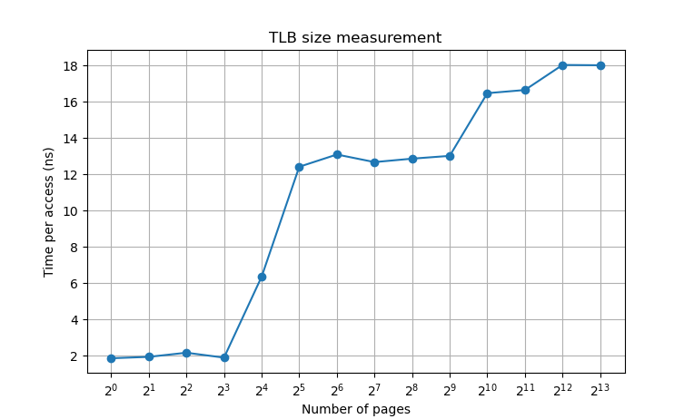

1. For timing, you’ll need to use a timer. How precise is such a timer? How long does an operation have to take in order for you to time it precisely? (this will help determine how many times, in a loop, you’ll have to repeat a page access in order to time it successfully)

    Measured operations need to take longer than the resolution of the clock to time them precisely. We can use `std::chrono::steady_clock` (on my machine `tick period = 1 ns`).

2. Write the program, called `tlb.c`, that can roughly measure the cost of accessing each page. Inputs to the program should be: the number of pages to touch and the number of trials.

    * See `tlb.cpp`, `usage: out/tlb <ntrials> <npages>`
    * Mod: subtract loop overhead
    * Mod: automatically set variable `ntrials = 10 ** (9 - (int) log10(npages))` when argument `ntrials <= 0`

3. Now write a script in your favorite scripting language (bash?) to run this program, while varying the number of pages accessed from 1 up to a few thousand, perhaps incrementing by a factor of two per iteration. Run the script on different machines and gather some data. How many trials are needed to get reliable measurements?

    ```sh
    $ run.sh
    #   pagesize clkfreq       ntrials    npages     toh+taccess (s) tavg (ns)
    CST 4096     1000000000 IN 1000000000 1      OUT 2.66908+4.53284 1.86376
    CST 4096     1000000000 IN 1000000000 2      OUT 3.62024+7.50056 1.94016
    CST 4096     1000000000 IN 1000000000 4      OUT 6.45706+15.1348 2.16944
    CST 4096     1000000000 IN 1000000000 8      OUT 13.5657+28.7438 1.89726
    CST 4096     1000000000 IN 100000000  16     OUT 3.24132+13.4216 6.3627
    CST 4096     1000000000 IN 100000000  32     OUT 7.88602+47.6485 12.4258
    CST 4096     1000000000 IN 100000000  64     OUT 17.9675+101.817 13.1015
    CST 4096     1000000000 IN 10000000   128    OUT 4.12679+20.3613 12.6832
    CST 4096     1000000000 IN 10000000   256    OUT 8.06196+41.0161 12.8727
    CST 4096     1000000000 IN 10000000   512    OUT 15.977+82.6725  13.0265
    CST 4096     1000000000 IN 1000000    1024   OUT 3.19592+20.0766 16.485
    CST 4096     1000000000 IN 1000000    2048   OUT 6.37834+40.4981 16.66
    CST 4096     1000000000 IN 1000000    4096   OUT 12.7753+86.6754 18.042
    CST 4096     1000000000 IN 1000000    8192   OUT 25.8433+173.505 18.0252
    ```

4. Next, graph the results, making a graph that looks similar to the one above. Use a good tool like `ploticus` or even `zplot`. Visualization usually makes the data much easier to digest; why do you think that is?

    

5. One thing to watch out for is compiler optimization. Compilers do all sorts of clever things, including removing loops which increment values that no other part of the program subsequently uses. How can you ensure the compiler does not remove the main loop above from your TLB size estimator?

    We need to turn off compiler optimizations. They should be turned off by default, but we can explicitly disable them with `gcc/g++ -O0 [...]`.

6. Another thing to watch out for is the fact that most systems today ship with multiple CPUs, and each CPU, of course, has its own TLB hierarchy. To really get good measurements, you have to run your code on just one CPU, instead of letting the scheduler bounce it from one CPU to the next. How can you do that? (hint: look up “pinning a thread” on Google for some clues) What will happen if you don’t do this, and the code moves from one CPU to the other?

    Without setting our process' cpu affinity there will be TLB misses when it is first run on each CPU. We can use `taskset(1)` (alternatives: `sched_setaffinity(2)`, `pthread_setaffinity_np(3)`). `run.sh`: `#!/bin/env -S taskset -c 0 bash`.

7. Another issue that might arise relates to initialization. If you don’t initialize the array a above before accessing it, the first time you access it will be very expensive, due to initial access costs such as demand zeroing. Will this affect your code and its timing? What can you do to counterbalance these potential costs?

    We time accesses to elements of the array in the for loop, thus if first access is longer due to the uninitialized array it will impact our measurements. To avoid this we can use `calloc(3)` (C) or `new char[10]()` ([C++ value initialization](https://en.cppreference.com/w/cpp/language/value_initialization)).
