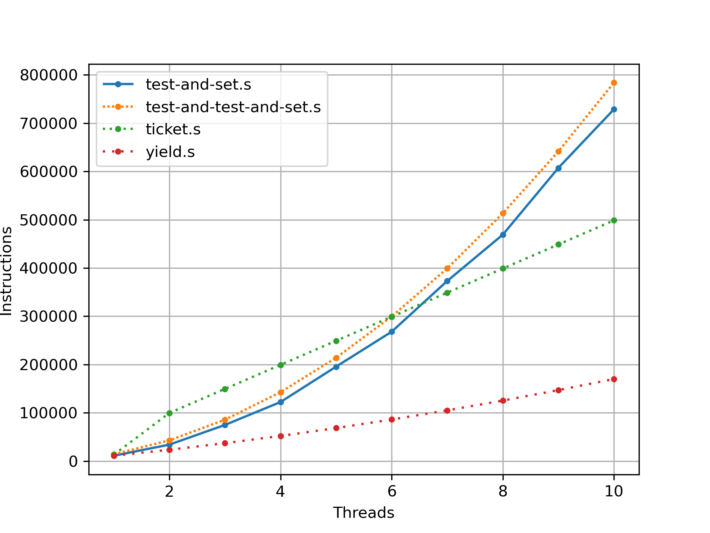

Q1. Examine `flag.s`. This code “implements” locking with a single memory flag. Can you understand the assembly?

It's a spin lock using loads/stores, which doesn't work as intended as we saw in section 28.6 of the book.

1. busy-wait for lock to be free (`test $0, %ax`) and acquire it once it is (`mov  $1, flag`)
2. critical section: increment the value stored at the `count` address
3. release lock
4. loop/jump to the beginning of the program if `%bx > 0` else stop program

Q2. When you run with the defaults, does `flag.s` work? Use the `-M` and `-R` flags to trace variables and registers (and turn on `-c` to see their values). Can you predict what value will end up in `flag`?

```
 flag count    bx          Thread 0                Thread 1

    0     0     0
    0     0     0   1000 mov  flag, %ax
    0     0     0   1001 test $0, %ax
    0     0     0   1002 jne  .acquire
    1     0     0   1003 mov  $1, flag
    1     0     0   1004 mov  count, %ax
    1     0     0   1005 add  $1, %ax
    1     1     0   1006 mov  %ax, count
    0     1     0   1007 mov  $0, flag
    0     1    -1   1008 sub  $1, %bx
    0     1    -1   1009 test $0, %bx
    0     1    -1   1010 jgt .top
    0     1    -1   1011 halt
    0     1     0   ----- Halt;Switch -----  ----- Halt;Switch -----
    0     1     0                            1000 mov  flag, %ax
    0     1     0                            1001 test $0, %ax
    0     1     0                            1002 jne  .acquire
    1     1     0                            1003 mov  $1, flag
    1     1     0                            1004 mov  count, %ax
    1     1     0                            1005 add  $1, %ax
    1     2     0                            1006 mov  %ax, count
    0     2     0                            1007 mov  $0, flag
    0     2    -1                            1008 sub  $1, %bx
    0     2    -1                            1009 test $0, %bx
    0     2    -1                            1010 jgt .top
    0     2    -1                            1011 halt
```

The result (`count = 2`) is correct in this case because the number of instructions per thread (12) is inferior to the interrupt interval (50), thus no interleaving happens.

Q3. Change the value of the register `%bx` with the `-a` flag (e.g. `-a bx=2,bx=2` if you are running just two threads). What does the code do? How does it change your answer for the question above?

The result (count = 4) still is correct for the same reason as previously (instructions per thread = 23, interrupt interval = 50).

Q4. Set `bx` to a high value for each thread, and then use the `-i` flag to generate different interrupt frequencies; what values lead to a bad outcomes? Which lead to good outcomes?

* For an interrupt interval of 50, setting `%bx >= 10` leads to incorrect results.
* For a set value of `%bx` (e.g. 100), setting an interrupt interval such that interrupts always occur outside the critical section (e.g. multiples of 11) lead to good outcomes.
```sh
for i in {1..800}; do
    echo -n "$i "
    ./x86.py -p flag.s -a bx=100 -M count -i "$i" -c | tail -n 1
done | awk '$2 == 200 { print $0 }'
```

Q5. Now let’s look at the program `test-and-set.s`. First, try to understand the code, which uses the `xchg` instruction to build a simple locking primitive. How is the lock acquire written? How about lock release?

This code uses a test-and-set / atomic exchange instruction to implement a spin lock. The lock is acquired by atomically swapping the content of register `$ax=1` with the content of `mutex`. The lock is released by setting `mutex=0`.

Q6. Now run the code, changing the value of the interrupt interval (`-i`) again, and making sure to loop for a number of times. Does the code always work as expected? Does it sometimes lead to an inefficient use of the CPU? How could you quantify that?

This test-and-set spin lock is correct, however spin-waiting is inefficient. We can check the number of instructions executed depending on the interrupt interval to quantify it.

```sh
for i in {1..800}; do
    echo -n "$i "
    ./x86.py -p test-and-set.s -a bx=100 -M count -i "$i" -c \
        | sed '/.*---.*/d' | wc -l
done
# i n_instructions
# 1 3021
# 2 3413
# 3 3025
# 4 3213
# 5 3017
# 6 3417
# 7 3301
# 8 2829
# 9 3013
# 10 3005
# [...]
# 1096 3317
# 1097 2221
# 1098 2221
# 1099 2221
# 1100 2221
# [...]
```

Q7. Use the `-P` flag to generate specific tests of the locking code. For example, run a schedule that grabs the lock in the first thread, but then tries to acquire it in the second. Does the right thing happen? What else should you test?

* worst case: interrupt between each instruction `./x86.py -p test-and-set.s -M count -P 01 -c` or `./x86.py -p test-and-set.s -M count -i 1 -c`
* should be as exhaustive as possible by testing a wide range of interrupt intervals (`-i`) or `--procsched` combinations, with different number of iterations `%bx` and different number of threads (`-t`)

Q8. Now let’s look at the code in `peterson.s`, which implements Peterson’s algorithm (mentioned in a sidebar in the text). Study the code and see if you can make sense of it.

Q9. Now run the code with different values of `-i`. What kinds of different behavior do you see? Make sure to set the thread IDs appropriately (using `-a bx=0,bx=1` for example) as the code assumes it.

Q10. Can you control the scheduling (with the `-P` flag) to “prove” that the code works? What are the different cases you should show hold? Think about mutual exclusion and deadlock avoidance.

Q11. Now study the code for the ticket lock in `ticket.s`. Does it match the code in the chapter? Then run with the following flags: `-a bx=1000,bx=1000` (causing each thread to loop through the critical section 1000 times). Watch what happens; do the threads spend much time spin-waiting for the lock?

* `./x86.py -p ticket.s -a bx=1000 | sed '/.*---.*/d' | wc -l`: 99481
* `./x86.py -p test-and-set.s -a bx=1000 | sed '/.*---.*/d' | wc -l`: 33972

Q12. How does the code behave as you add more threads?

```sh
generate_one() {
    echo -n "$1 $2 "
    ./x86.py -a bx=1000 -p "$1" -t "$2" | sed '/.*---.*/d' | wc -l
}
export -f generate_one

time parallel 'generate_one {}' \
    ::: test-and-set.s ticket.s yield.s \
    ::: {1..10} \
    | ./plot.py > plot.png
```



Q13. Now examine `yield.s`, in which a yield instruction enables one thread to yield control of the CPU (realistically, this would be an OS primitive, but for the simplicity, we assume an instruction does the task). Find a scenario where `test-and-set.s` wastes cycles spinning, but `yield.s` does not. How many instructions are saved? In what scenarios do these savings arise?

* See figure in previous question.
* Savings occur when one thread has the lock and other threads are waiting for it to be released. In `test-and-set.s` waiting means spinning, while in `yield.s` waiting means yielding control of the CPU.

Q14. Finally, examine `test-and-test-and-set.s`. What does this lock do? What kind of savings does it introduce as compared to `test-and-set.s`?

This lock repeatedly stores the value of `mutex` in a register, tests if the lock **might** be free and then tries to atomically lock using `xchg`. By doing so we add some overhead to our lock in terms of number of instructions executed (see plot in Q12), but we avoid doing multiple writes to a shared resource in memory. [[ref](https://en.wikipedia.org/wiki/Test_and_test-and-set)]
