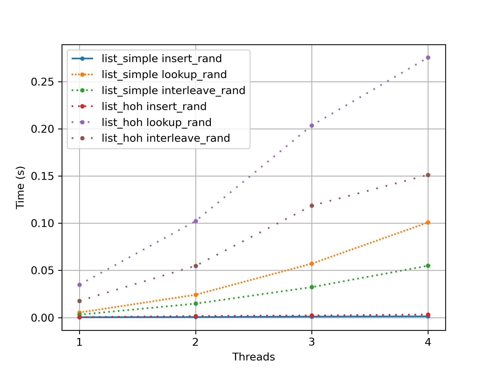
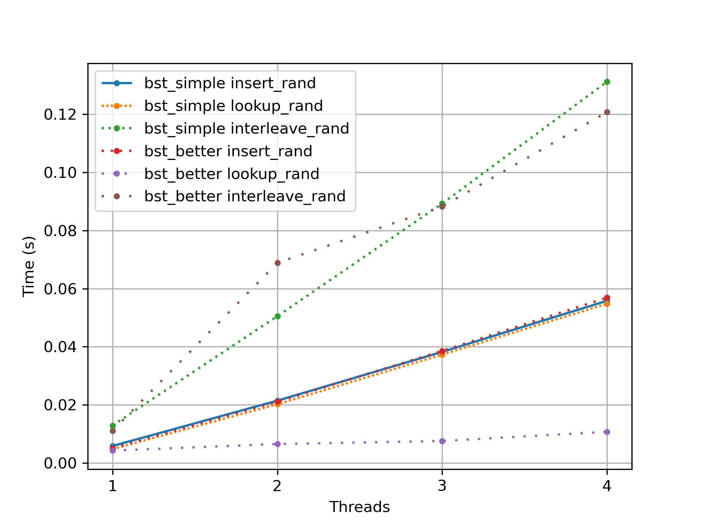

Q1. We’ll start by redoing the measurements within this chapter. Use the call `gettimeofday()` to measure time within your program. How accurate is this timer? What is the smallest interval it can measure? Gain confidence in its workings, as we will need it in all subsequent questions. You can also look into other timers, such as the cycle counter available on x86 via the `rdtsc` instruction.

I used `std::chrono::steady_clock` w/ a `tick period` of 1 ns on my computer.

Q2. Now, build a simple concurrent counter and measure how long it takes to increment the counter many times as the number of threads increases. How many CPUs are available on the system you are using? Does this number impact your measurements at all?

* See `counter_simple.cpp`.
* The following plot shows the execution time of `counter_simple` and `counter_sloppy` (`threshold=1024`) with `nthreads=[1;4]` and `nloops=1000000` averaged over 100 experiments. My system has 2 cores each able to run 2 threads in parallel.

Q3. Next, build a version of the sloppy counter. Once again, measure its performance as the number of threads varies, as well as the threshold. Do the numbers match what you see in the chapter?

* See `counter_sloppy.cpp` and the plot in the previous question.
* The following plot shows the execution time of `counter_sloppy` with `nthreads=4`, `nloops=1000000` and `threshold=[2**0;2**10]` averaged over 100 experiments.

Q4. Build a version of a linked list that uses hand-over-hand locking [MS04], as cited in the chapter. You should read the paper first to understand how it works, and then implement it. Measure its performance. When does a hand-over-hand list work better than a standard list as shown in the chapter?

* See `list_simple.cpp` ~~and `list_hoh.cpp`~~ (deleted, incorrect implementation).
* The following plot show the execution time of lookup, insert and interleaved operations on random elements of `list_simple` (coarse-grained lock) with `nthreads=4` and `nloops=1000` averaged over 100 experiments.
* > Conceptually, a hand-over-hand linked list makes some sense; it enables a high degree of concurrency in list operations. However, in practice, it is hard to make such a structure faster than the simple single lock approach, as the overheads of acquiring and releasing locks for each node of a list traversal is prohibitive. Even with very large lists, and a large number of threads, the concurrency enabled by allowing multiple ongoing traversals is unlikely to be faster than simply grabbing a single lock, performing an operation, and releasing it. ― OSTEP 29.2 Concurrent Linked Lists

Q5. Pick your favorite interesting data structure, such as a B-tree or other slightly more interested structure. Implement it, and start with a simple locking strategy such as a single lock. Measure its performance as the number of concurrent threads increases.

See `bst_simple.cpp`.

Q6. Finally, think of a more interesting locking strategy for this favorite data structure of yours. Implement it, and measure its performance. How does it compare to the straightforward locking approach?

See `bst_better.cpp`. I used a `std::shared_mutex` instead of a `std::mutex`. Read-only sections are locked with `lock_shared()` and write sections are locked with `lock()`. It allows multiple read operations to happen concurrently as long as no write happen at the same time.

