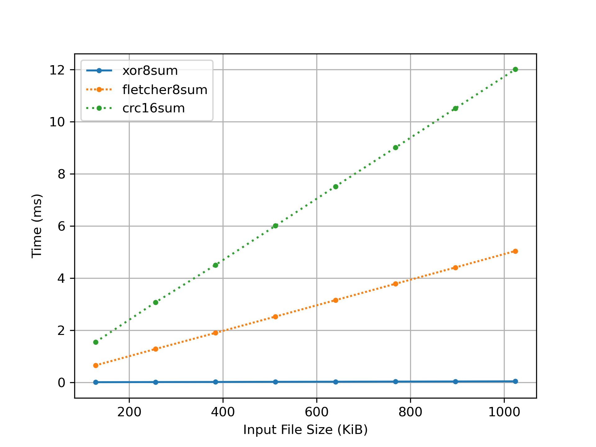

# Simulation

~~**Q1**. First just run `checksum.py` with no arguments. Compute the additive, XOR-based, and Fletcher checksums. Use `-c` to check your answers.~~

~~**Q2**. Now do the same, but vary the seed (`-s`) to different values.~~

**Q3**. Sometimes the additive and XOR-based checksums produce the same checksum (e.g., if the data value is all zeroes). Can you pass in a 4-byte data value (using the `-D` flag, e.g., `-D` a,b,c,d) that does not contain only zeroes and leads the additive and XOR-based checksum having the same value? In general, when does this occur? Check that you are correct with the `-c` flag.

```
$ ./checksum.py -D 0,1,2,4 -c
$ ./checksum.py -D 1,2,4,8 -c
$ ./checksum.py -D 16,32,2,64 -c
```

Four different multiples of 2 produce the same additive and xor-based checksums. The bytes don't have overlapping 1s so there's no carry during the binary addition. Thus, in this case, the addition is equivalent to a bitwise XOR.

~~**Q4**. Now pass in a 4-byte value that you know will produce a different checksum values for additive and XOR. In general, when does this occur?~~

**Q5**. Use the simulator to compute checksums twice (once each for a different set of numbers). The two number strings should be different (e.g., `-D a1,b1,c1,d1` the first time and `-D a2,b2,c2,d2` the second) but should produce the same additive checksum. In general, when will the additive checksum be the same, even though the data values are different? Check your specific answer with the `-c` flag.

```
$ ./checksum.py -D 2,3,7,4 -c
$ ./checksum.py -D 2,3,4,7 -c
$ ./checksum.py -D 1,3,5,7 -c
```

The additive checksum produce the same value for reordered bytes and for bytes producing the same final sum.

**Q6**. Now do the same for the XOR checksum.

```
$ ./checksum.py -D 2,3,7,4 -c
$ ./checksum.py -D 2,3,4,7 -c
```

The XOR-based checksum is also order insensitive.

**Q7**. Now let’s look at a specific set of data values. The first is: `-D 1,2,3,4`. What will the different checksums (additive, XOR, Fletcher) be for this data? Now compare it to computing these checksums over `-D 4,3,2,1`. What do you notice about these three checksums? How does Fletcher compare to the other two? How is Fletcher generally “better” than something like the simple additive checksum?

The Fletcher checksum is order sensitive. Less collisions will happen compared to the simple additive and XOR checksums.

**Q8**. No checksum is perfect. Given a particular input of your choosing, can you find other data values that lead to the same Fletcher checksum? When, in general, does this occur? Start with a simple data string (e.g., `-D 0,1,2,3`) and see if you can replace one of those numbers but end up with the same Fletcher checksum. As always, use `-c` to check your answers.

```
$ ./checksum.py -D 0,1,2,3 -c
$ ./checksum.py -D 255,1,2,3 -c
```

The Fletcher checksum cannot differentiate between `0x00` and `0xFF` bytes at the same position.

# Code

**Q1**. Write a short C program (called `check-xor.c`) that computes an XOR-based checksum over an input file, and prints the checksum as output. Use a 8-bit unsigned char to store the (one byte) checksum. Make some test files to see if it works as expected.

```
$ cargo test
[...]
$ cargo run --bin=check-xor manual.md
xor8sum 3 0x03 0b00000011
```

**Q2**. Now write a short C program (called `check-fletcher.c`) that computes the Fletcher checksum over an input file. Once again, test your program to see if it works.

```
$ cargo test
[...]
$ cargo run --bin=check-fletcher manual.md
fletcher8sum 26,183 0x1a,0xb7 0b00011010,0b10110111
```

**Q4**. Read about the 16-bit CRC and then implement it. Test it on a number of different inputs to ensure that it works.

```
$ cargo test
[...]
$ cargo run --bin=check-crc manual.md
crc16sum 55953 0xda91 0b1101101010010001
```

**Q3mod**. Now compare the performance of the three: is one faster? How does performance change as the size of the input file changes? Use internal calls to `gettimeofday` to time the programs. Which should you use if you care about performance? About checking ability?

```
$ time cargo criterion --message-format=json > benches/benchmark.json
$ ./plot.py benches/benchmark.json > benches/benchmark.png
```



`xor8sum` is faster than `fletcher8sum` which is faster than `crc16sum`. Please note that all three implementations are naive. The XOR checksum is less reliable (more collisions) than Fletcher's checksum because it fails to detect reordered bytes. CRC is more reliable than both. All three are weak to collision attacks compared to cryptographic hash functions, but they are faster.

**Q5**. Now build a tool (`create-csum.c`) that computes a single-byte checksum for every 4KB block of a file, and records the results in an output file (specified on the command line). Build a related tool (`check-csum.c`) that reads a file, computes the checksums over each block, and compares the results to the stored checksums stored in another file. If there is a problem, the program should print that the file has been corrupted. Test the program by manually corrupting the file.
